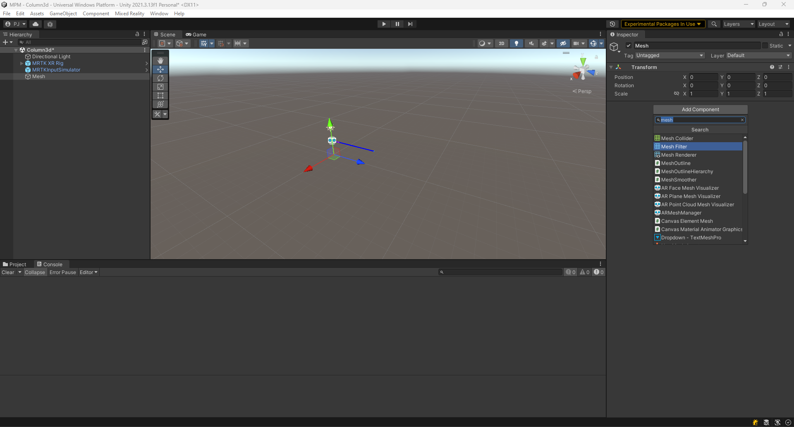

## Version Compatibility warnings

- If you are using Visual Studio 2022 17.4.x, there exists a compiler bug that doesn't allow it to compile projects for universal Windows Platform (UWP), used for HoloLens 2 deployment. One can either downgrade to Visual Studio 2022 17.3.x or ensure using a unity version which has the fix, i.e, Unity 2020.3.42f1, 2021.3.14f1, 2022.1.23f1, 2022.2.0b16 and 2023.1.0a19. The bug can be tracked on this [link](https://forum.unity.com/threads/workaround-for-building-with-il2cpp-with-visual-studio-2022-17-4.1355570/).

-  The Universal Render Pipeline for the 2021 LTS version has some performance issues at the time of writing this guide. The status of the known issue can be tracked from [this link](https://learn.microsoft.com/en-us/windows/mixed-reality/develop/unity/known-issues). We suggest using the built-in render pipeline until the bug is fixed.

- Point Renderer on Apple Silicon Macs is showing squares instead of points in the renderer. We suggest to wait until this is solved by Unity. Currently, there is no estimate of when this fix can be expected.

## Sample project output

## Guide for building the sample project for HoloLens 2

 - Download Unity Hub and point the hub to the downloaded by clicking on the dropdown next to the Open button and selecting "Add project from Disk". Point the location of the downloaded sample project in the window. Unity should now build the project.

 - Once Unity project opens enter the play mode to visualize the Column3D scene.
 

## Guide for a new project

 - Create a New Unity Project. The screenshot below shows a project with default 3D template.
 

 - Setup Microsoft Mixed Reality Toolkit 3 (MRTK3) in your new project using the [official setup guide](https://learn.microsoft.com/en-us/windows/mixed-reality/mrtk-unity/mrtk3-overview/setup). The [sample project](/unity/) uses the shown MRTK3 packages and the Mixed Reality OpenXR Plugin.

- Set up the scene with MRTK XR Rig and MRTKInputSimulator prefabs and delete the default Main Camera in the scene. Enter the Unity play mode to verify that everything works fine. 

- Create an empty game object in the scene hierarchy from the context menu as shown in the screenshot.

- Name the newly created GameObject as Mesh. Add Mesh Filter and Mesh Renderer components to this Mesh GameObject from the add component option in the inspector window as shown below.

- Copy the MeshReader.cs script from the sample project to your desired location in the Unity Assets folder. Add the MeshReader component to the Mesh GameObject. This script assumes that you have the MPM input "mesh.txt" file generated in the Resources folder in the Assets folder. Add the initial input files in a Resources folder under the Assets directory. Enter the play mode and one should be able to see the point visualization of the file.

- Create another empty GameObject and name it as Particles. Again add Mesh Filter and Mesh Renderer components to this GameObject. Assign the ParticleReader.cs script from the sample project it. This script assumes that you have the MPM input "particles.txt" file generated in the Resources folder in the Assets folder. Add the initial input files in a Resources folder under the Assets directory. Enter the play mode and one should be able to see the point visualization of the file.

- Provide the value of simulation timesteps to the frameCount variable in the ParticleReader.cs. One now needs to provide the generated geometries in the FixedUpdate function. This can be done by exporting the geometries from ParaView to a .txt format. Place the .txt files in the Resoursces folder and supply the path in the FixedUpdate function of ParticleReader.cs.

- Enter the play mode and one should be able to visualize the simulation in the Game Window.

