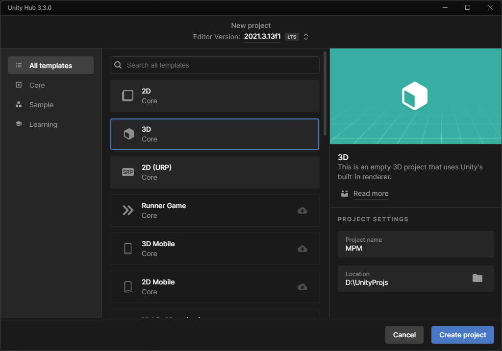
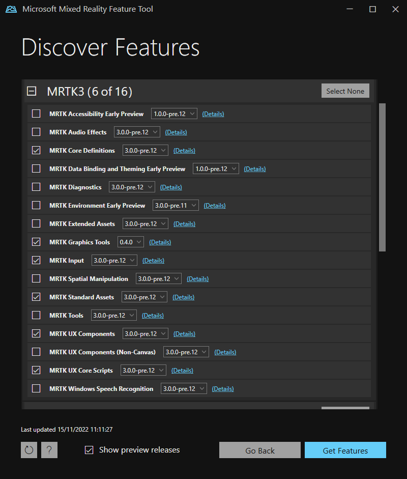
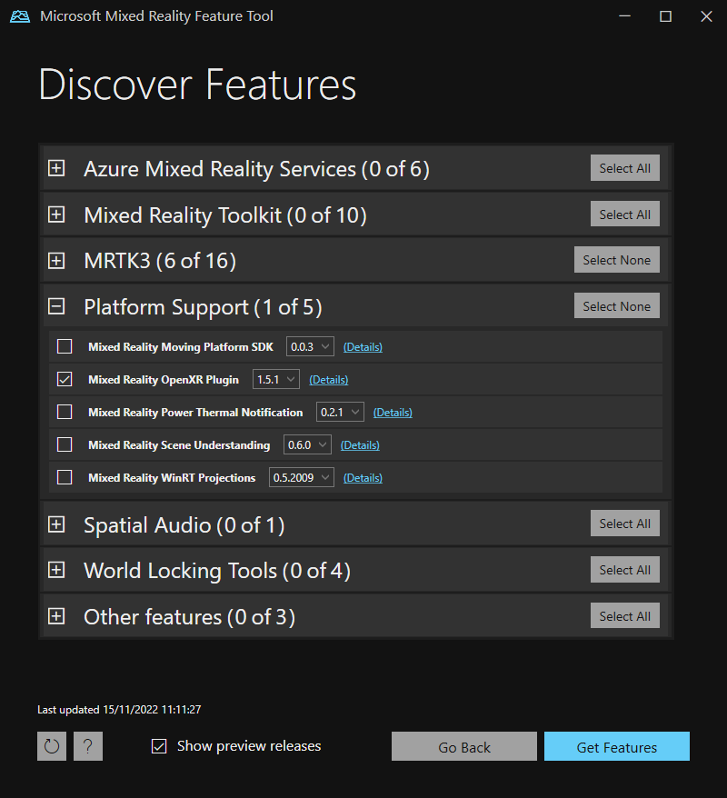
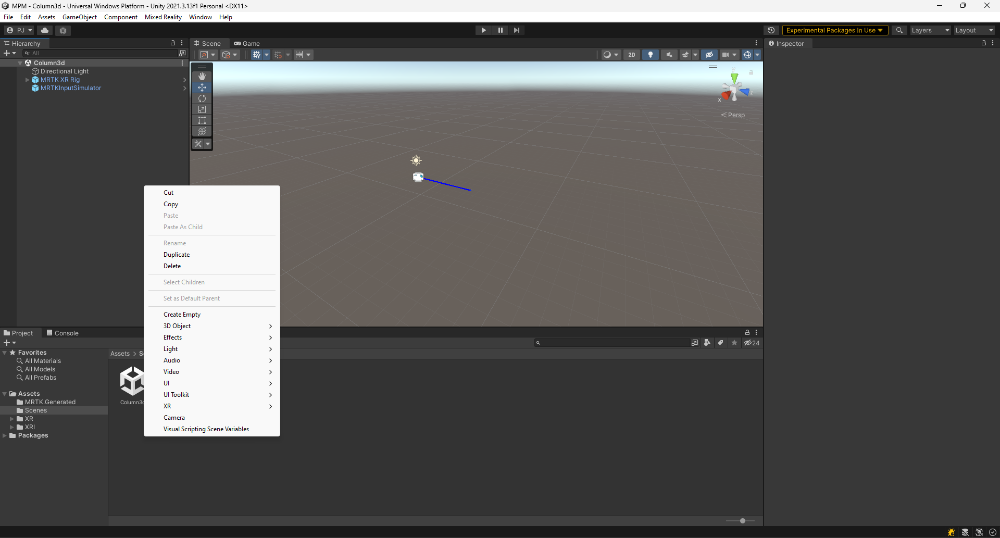

# Setup Instructions for a new project

 - Create a New Unity Project. The screenshot below shows a project with default 3D template. The Universal Render Pipeline for the 2021 LTS version has some perfomance issues at the time of writing this guide. The status of the known issue can be tracked from [this link](https://learn.microsoft.com/en-us/windows/mixed-reality/develop/unity/known-issues).
 

 - Setup Microsoft Mixed Reaity Toolkit 3 (MRTK3) in your new project using the [official setup guide](https://learn.microsoft.com/en-us/windows/mixed-reality/mrtk-unity/mrtk3-overview/setup). The [sample project](/unity/) uses the shown MRTK3 packages and the Mixed Reality OpenXR Plugin.

- Setup the scene with MRTK XR Rig and MRTKInputSimulator prefabs and delete the default Main Camera in the scene. Enter the Unity play mode to verift that everything works fine. 

- Create a empty game object in the scene heirarcy from the context menu as shown in the screenshot.

- Name the newly created gameobject Mesh. Add Mesh Filter and Mesh Renderer components to the 
